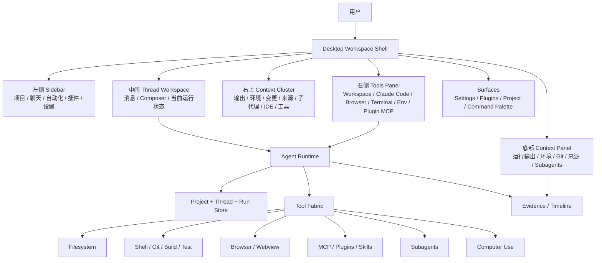
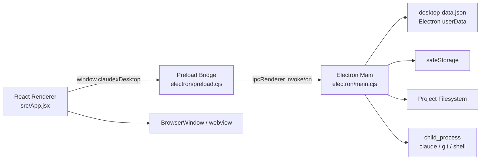
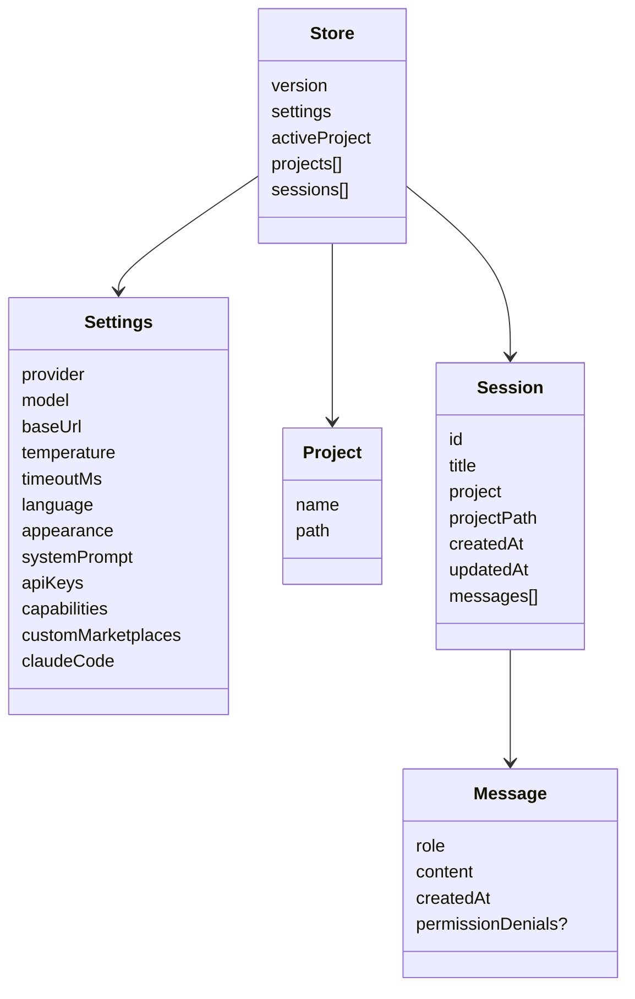
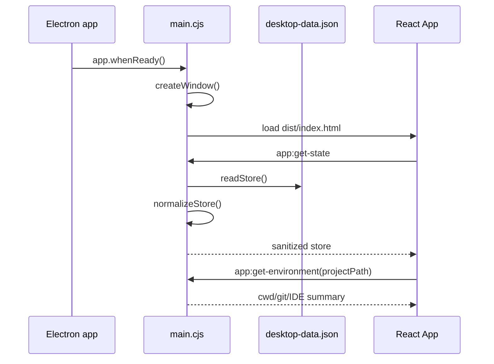
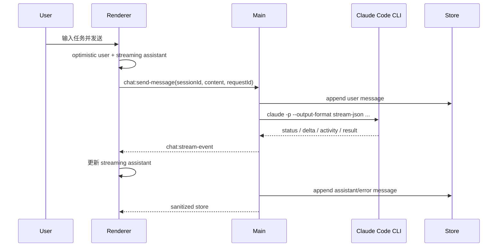
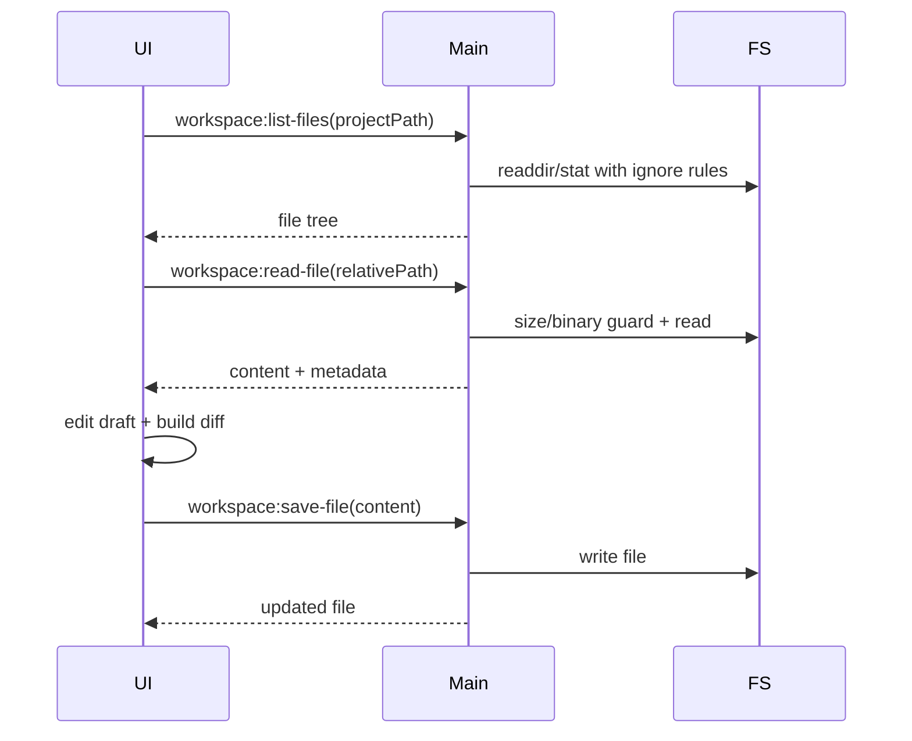
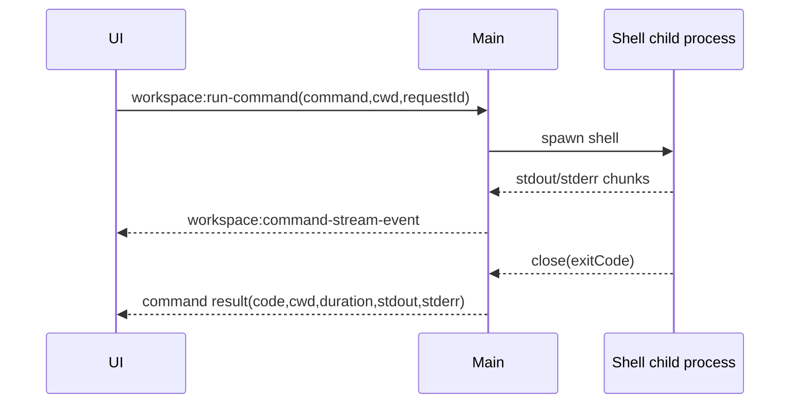

# Codex App 深度 UIUX / 系统架构 / Claudex 对齐蓝图

**日期**：2026-07-05  
**项目**：Claudex 桌面应用  
**目标**：把 Codex App 理解为一个“本地 agent 工作台 / agent OS”，并把每个 UIUX 细节、功能、架构、数据流和 Claudex 对齐路线落成可执行蓝图。

---

## 0. 研究边界与证据来源

这份报告不是对 Codex App 私有源码的逆向；它基于可见的 Codex App 产品模型、Claudex 当前 repo、已实看 UI、QA 脚本和多个只读 subagent 交叉勘查得出。

| 来源 | 本报告如何使用 |
|---|---|
| `AGENTS.md:5-11` | 项目约束：接近 Codex App 桌面工作区，不做静态壳，保存前要 diff，完成后至少 build。 |
| `README.md:3-44` | 产品范围：Claude Code CLI、本地历史、项目/聊天/文件/命令/浏览器/插件/MCP/设置。 |
| `CODEX_APP_UIUX_REBUILD_SPEC.md:5-22` | UI 目标：低噪音、紧凑、项目/会话中心、真实本地状态。 |
| `design-qa.md:12-79` | 已完成的 UI 修复、真实能力和已知差距。 |
| `docs/CODEX_APP_BEHAVIOR_PARITY_PLAN.md:3-22` | 行为对齐原则和非目标。 |
| `docs/CODEX_APP_PARITY_PASS27_PLAN.md:3-19` | 关键对齐决策：Claude Code CLI 默认、真实工具组织、底部上下文只显示可验证状态。 |
| `docs/CLAUDEX_PASS34_UX_AUDIT_AND_FIX_PLAN.md:3-23` | 当前主 UI 验证点。 |
| `src/App.jsx:1042-4749` | 当前 UI 组件、状态、交互、surface、快捷键。 |
| `src/styles.css:1-5270` | 视觉 token、布局、字号、面板、响应式状态。 |
| `electron/main.cjs:175-1584` | 主进程 store、IPC、Claude Code、文件、命令、系统桥接。 |
| `electron/preload.cjs:3-45` | Renderer API 面。 |
| `qa/capture-pass34-calm-shell.cjs:118-204` | 主 UI smoke：默认右栏关闭、底部面板、工具、设置、插件、市场。 |
| `qa/capture-pass35-providers-cli.cjs:95-153` | 设置页、Direct API、provider 和 Claude 高级参数验证。 |
| `qa/capture-pass21-workspace-review-gate.cjs:97-219` | workspace 文件编辑和保存前 review gate。 |
| `qa/capture-pass18-keyboard-a11y.cjs:79-136` | 快捷键、焦点、可访问性验证。 |

---

## 1. 一句话模型

**Codex App 不是聊天页，而是一个以项目和线程为中心的本地 agent 操作系统。**

它的强大不来自“一个输入框接模型”，而来自以下四个不变量：

1. **项目即上下文**：当前 repo、路径、分支、文件、环境、IDE、终端都是一等状态。
2. **线程即工作单元**：每个 thread 不是一段聊天，而是一条可继续、可恢复、可审计的工作流。
3. **工具即能力边界**：文件、shell、git、浏览器、Computer Use、MCP、plugins、subagents 都要有状态、输出、失败和权限边界。
4. **证据即完成标准**：构建、测试、截图、diff、命令输出、工具结果比“模型说完成了”更重要。

---

## 2. 顶层系统蓝图



---

## 3. 产品心智模型

| 层 | 用户看到什么 | 系统实际职责 | Claudex 当前证据 |
|---|---|---|---|
| Desktop shell | 三栏、右上工具、底部上下文、surface | 把任务、项目、工具、状态组织成工作台 | `src/App.jsx:4215-4694`, `src/styles.css:105-110` |
| Project | 项目列表、当前项目 pill、workspace 文件 | 绑定 cwd、Git、IDE、文件和命令执行范围 | `electron/main.cjs:286-317`, `src/App.jsx:779-793` |
| Thread | 聊天记录、当前对话、streaming 状态 | 持久化用户意图、模型回复、错误、权限和后续证据 | `electron/main.cjs:1262-1346`, `src/App.jsx:1290-1722` |
| Agent runtime | “正在工作”的模型状态 | 调模型、解析流、路由工具、记录事件 | `electron/main.cjs:1037-1148` |
| Tools | 工作区、Claude Code、浏览器、终端、插件/MCP | 执行本地和外部动作，返回结构化结果 | `src/App.jsx:1893-2943`, `electron/main.cjs:1463-1584` |
| Evidence | 输出、变更、来源、子代理 | 证明工作是否完成、是否可交付 | `src/App.jsx:1544-1717` |

---

## 4. UIUX 全量拆解

### 4.1 App Shell

当前 shell 由 `App()` 统一管理：`src/App.jsx:4215-4694`。

| 细节 | 当前实现 | 目标 |
|---|---|---|
| Root shell | `app-shell` + `app-grid` | 桌面工作台根容器。 |
| 三栏布局 | `304px / main / 340-380px`，见 `src/styles.css:105-110` | 左栏导航、中间 thread、右栏工具。 |
| 左栏隐藏 | `.app-grid.sidebar-hidden`，见 `src/styles.css:5238-5244` | 给主工作区让空间。 |
| 右栏隐藏 | `.app-grid.right-panel-hidden`，见 `src/styles.css:5257-5266` | 当前完全隐藏；建议保留窄 tool rail。 |
| Surface 模式 | settings/capabilities 替换中间区域，见 `src/App.jsx:4587-4600` | 设置/插件像桌面工作区 surface，不像网页弹窗。 |
| Toast/Warning | `desktop-warning`、`toast`，见 `src/App.jsx:4561-4565` | 顶部短反馈，不打断任务。 |

**设计原则**：

- 默认安静，不展示大块营销/说明卡片。
- 右侧工具要可发现，但不长期占主空间。
- surface 要明确“返回应用”，不能让用户迷失。
- 全局状态要有可见落点：项目、模型、环境、错误、运行中。

---

### 4.2 左侧 Sidebar

当前实现：`Sidebar()`，`src/App.jsx:1042-1197`；样式主要在 `src/styles.css:113-486`。

| 区域 | UI 元素 | 目的 | 当前成熟度 |
|---|---|---|---|
| 顶部主动作 | `新聊天` + `Ctrl+N` | 快速创建 thread | 高 |
| 折叠按钮 | sidebar collapse | 主工作区扩展 | 高 |
| 搜索 | 聊天搜索 input | 快速找历史 | 中高 |
| 导航入口 | 自动化、插件 | 进入 automation / plugin surface | 中 |
| 项目区 | 当前项目和最近项目 | Project 是一等上下文 | 中 |
| 聊天记录 | thread list、草稿、stream dot、permission badge | Thread 是一等工作单元 | 中 |
| 底部运行态 | 本地运行时、模型、设置 gear | 当前 runtime 状态 | 中高 |

**细节要求**：

- 项目条目显示 basename，完整路径放 tooltip。
- Thread 条目要有标题、项目副标题、时间/状态、选中态。
- Streaming 不能只靠颜色；应有 icon/dot + title。
- 左栏只做导航和上下文，不放 provider/API key 大警告。

**缺口**：

- Thread 缺 rename/archive/pin/delete/fork/resume。
- Project 缺按项目过滤 thread、路径失效提示、Git root 自动探测。
- 自动化入口还不是完整 automation runtime。

---

### 4.3 中间 Thread Workspace

当前实现：`Conversation()`，`src/App.jsx:1290-1722`。

#### 空态

当前空态核心是“今天要做什么？”和 composer。它接近 Codex App 的低噪音深色工作区，但要注意避免普通网页 hero 感。

| 细节 | 要求 |
|---|---|
| 标题 | 任务启动提示，不是营销 slogan。 |
| 副文案 | 少而明确，不重复功能列表。 |
| Composer | 是主角，项目/权限/模型/发送都在一处。 |
| 当前项目 | 必须明确；无项目时要给一键选择或自动识别。 |

#### 消息区

| 元素 | 当前位置 | 作用 |
|---|---|---|
| Thread header | `src/App.jsx:1459-1467` | 当前对话和模型状态。 |
| Messages | `src/App.jsx:1469-1518` | user/assistant/error。 |
| Streaming assistant | `src/App.jsx:1497-1517` | delta/status/activity。 |
| Permission notice | `src/App.jsx:1488-1494` | 权限失败时打开 Interactive Claude。 |
| Composer dock | `src/App.jsx:1520-1535` | 多轮输入固定在底部。 |
| Retry action | `src/App.jsx:1536-1541` | 重试最后一条用户消息。 |

**Codex App 级目标**：

- Assistant 消息能展开“读了什么、跑了什么、改了什么、验证了什么”。
- 错误消息有下一步：重试、打开终端、打开 Claude TUI、复制输出。
- 流式状态区分排队、规划、工具调用、等待命令、总结。

---

### 4.4 Composer

当前实现：`WelcomeComposer()`，`src/App.jsx:1198-1289`；样式 `src/styles.css:769-940`。

| 元素 | 当前 UI | 目标 |
|---|---|---|
| Textarea | `输入任何任务` | 主任务入口。 |
| Project pill | 当前项目/选择项目 | 当前上下文必须一眼可见。 |
| Permission pill | 默认权限 | 快速理解权限模式。 |
| Shortcut hint | `Enter 发送 · Shift+Enter 换行 · Ctrl+/ 快捷键` | 低噪音学习成本降低。 |
| Model pill | `Claude Code` + 模型 | 告知 runtime/model。 |
| Send button | 圆形 icon | 明确可发送/停止。 |

#### 当前视觉 token

| 项 | 值 | 证据 |
|---|---:|---|
| 背景 | `--composer: #232323` | `src/styles.css:28` |
| 边框 | `--composer-border: #353535` | `src/styles.css:29` |
| Radius | `14px` | `src/styles.css:769-775` |
| Textarea min/max | `46px / 132px` | `src/styles.css:793-797` |
| Textarea 字号 | `14px`, line-height `1.45` | `src/styles.css:803-806` |
| chip/button 高度 | `32px` | `src/styles.css:834-847` |
| hint 字号 | `11.5px` | `src/styles.css:884-893` |

#### 交互规则

- Enter 发送，Shift+Enter 换行。
- Ctrl/Cmd+Enter 也发送。
- 输入框内不应被 Ctrl+P/Ctrl+T/Ctrl+K 等全局快捷键打断。
- Ctrl/Cmd+/ 可在输入框内打开快捷键帮助。
- 发送后应出现 optimistic user + streaming assistant，并最终由 store 返回真实 session。

---

### 4.5 右上 Context Cluster

当前实现：`Conversation()` 顶部 actions，`src/App.jsx:1365-1427`；样式 `src/styles.css:567-711`。

| 功能 | 当前 UI | 目标 |
|---|---|---|
| 输出 | compact icon | 有运行输出时显示 activity。 |
| 环境 | compact icon | cwd/Git/IDE 状态入口。 |
| 变更 | compact icon | dirty count / diff status。 |
| 来源 | compact icon | 当前 thread 读过/引用过的文件。 |
| 子代理 | compact icon | subagent running/done/error 状态。 |
| IDE picker | VS Code/Cursor/Windsurf | 当前项目打开到 IDE。 |
| 工具 toggle | `工具` / `关闭` | 右侧 tools panel 开关。 |

当前 active context button 会从 icon 展开成文字，样式见 `src/styles.css:671-692`。

**缺口**：

- 图标缺状态 badge。
- 右栏关闭后工具入口只在顶部，发现性弱。
- bottom panel 当前是浮层，可能遮挡聊天/composer。

---

### 4.6 右侧 Tools Panel

当前实现：`ToolsPanel()`，`src/App.jsx:1893-2943`；样式 `src/styles.css:1297-1390`。

#### Panel 顶部

| 元素 | 功能 |
|---|---|
| 标题 `工具` | 说明当前右栏区域。 |
| 能力按钮 | 打开插件/技能/工具 surface。 |
| 终端按钮 | 打开真实终端。 |
| 设置按钮 | 打开设置。 |
| 关闭按钮 | 关闭右侧面板。 |

#### Tool rows

| Tool | 当前能力 | Codex App 级目标 |
|---|---|---|
| 工作区 | 文件树、读文件、编辑、diff review、保存、命令运行 | 当前 repo 文件/命令主入口，支持搜索、diff、冲突保护。 |
| Claude Code | CLI 状态、快速命令、插件操作、命令历史 | 结构化展示 auth/model/plugins/MCP/permissions。 |
| 浏览器 | 内嵌 webview + 外部打开 | 服务页面验证和 agent 浏览任务，错误可恢复。 |
| 终端 | 打开真实终端、复制路径 | 原生 TUI 和交互命令 escape hatch。 |
| 环境 | cwd、Git、IDE、env | 折叠摘要 + 可刷新。 |
| 插件和 MCP | raw output | 升级为结构化 list/catalog。 |

#### 当前视觉

| 项 | 当前值 |
|---|---|
| Panel rows | `52px + minmax(0, 1fr)` (`src/styles.css:1297-1303`) |
| Tool group gap | `8px` (`src/styles.css:1338-1345`) |
| Tool row grid | `20px / 1fr / auto` (`src/styles.css:1353-1358`) |
| Tool row padding | `11px 12px` (`src/styles.css:1360-1365`) |
| Active border | accent rgba (`src/styles.css:1374-1377`) |

**缺口**：

- 340-380px 对 Workspace/Claude 输出偏窄。
- 命令历史和 raw output 容易堆叠。
- 右栏关闭时工具完全消失；建议增加 44px tool rail。

---

### 4.7 底部 Context Panel

当前实现：`Conversation()` 底部面板，`src/App.jsx:1544-1717`；样式 `src/styles.css:4844-4890`。

| Tab | 当前状态 | 目标状态 |
|---|---|---|
| 输出 | 有 activity/摘要 | 统一 run timeline。 |
| 环境 | 有 cwd/project/IDE/Git | 保持并加入刷新/错误。 |
| 变更 | raw git status | diff stat、file list、hunk。 |
| 来源 | 空态/入口 | 真实 source refs。 |
| 子代理 | 空态 | 真实 subagent lifecycle。 |
| 终端 | 打开真实终端 | 保持。 |
| 浏览器 | 打开右侧浏览器 | 保持。 |

**底部面板的正确定位**：它不是日志抽屉，而是当前 thread 的证据条。

它应该回答：

- 现在在跑什么？
- 哪些命令输出了什么？
- 哪些文件被读/改？
- 哪些测试/构建通过？
- 哪些 subagent 在跑？
- 哪些权限或错误需要接管？

**当前缺口**：

- 缺结构化 run timeline。
- 来源/子代理是空态。
- 浮层可能遮挡主区；建议 docked row 或打开时主区预留空间。

---

### 4.8 Settings Surface

当前实现：`SettingsModal()`，`src/App.jsx:2994-3585`。

#### 设置导航

当前 sections：`general`、`profile`、`appearance`、`configuration`、`personalization`、`mcp`、`browser`、`computer`、`hooks`、`connections`、`git`、`environments`、`worktrees`、`archived`，见 `src/App.jsx:3068-3083`。

#### 已有真实设置

| 域 | 内容 |
|---|---|
| 执行方式 | Claude Code / Direct API。 |
| 语言 | 中文 / 跟随系统。 |
| 外观 | compact/default/large；compact/comfortable。 |
| 权限 | default / acceptEdits / auto / plan / dontAsk / bypassPermissions。 |
| Claude 高级 | model、effort、command、agent、timeout、sessionName、tools、addDirs、mcpConfig、pluginDir/url、settings、extraArgs、safe/bare/ide/chrome/strict/no persistence/ax/verbose。 |
| Direct API | provider、model、baseUrl、apiKey、temperature、timeout。 |
| 存储 | safeStorage 状态、data file、env hint。 |

#### 目标

- 设置页服务当前运行方式，而不是占主流程。
- 默认只显示关键三件事：runtime、auth、model/env。
- Advanced 默认折叠。
- 与 Claude Code 不一致的能力不伪造；打开交互式 Claude 承接。

**缺口**：

- 部分分类只是状态摘要，不是完整设置页。
- MCP/browser/computer/hooks/git/worktrees 应 deep-link 到对应工具/Claude panel。
- 保存 footer 要持续清楚显示 dirty/saved/error。

---

### 4.9 Plugins / MCP / Marketplace Surface

当前实现：`CapabilityModal()`，`src/App.jsx:3627-3880`。

| 区域 | 当前功能 | 目标 |
|---|---|---|
| Tabs | 插件、MCP、技能、市场 | 保留。 |
| Installed strip | 已启用能力 icons | 加状态/错误。 |
| CLI summary | Claude CLI version/status | 保留。 |
| Search/filter | 搜能力、enabled/disabled | 加 source/type/filter。 |
| Capability list | `capabilityCatalog` 硬编码能力 | 接真实 plugin/skill/MCP registry。 |
| CLI raw output | plugin/mcp output | 移到 details。 |
| Marketplace | `plugin marketplace list` raw output | 结构化 catalog。 |
| Custom marketplaces | 保存 URL | 真正注入 CLI 或明确只是记录。 |

**目标行为**：

- 每个 plugin/MCP 都有来源、版本、状态、启用、错误、需要权限、可用工具列表。
- Marketplace 支持搜索、分类、安装、版本、风险提示、安装结果。
- raw output 是故障排查材料，不是主 UI。

---

### 4.10 Project Modal

当前实现：`ProjectModal()`，`src/App.jsx:3904-3934`。

应支持：

- 选择项目文件夹。
- 最近项目。
- 打开项目文件夹。
- 打开终端。
- 按项目过滤 thread。
- 移除 recent。
- 不存在路径提示。
- Git root 自动探测。

---

### 4.11 Command Palette

当前实现：`CommandPalette()`，`src/App.jsx:4098-4132`；commands 定义在 `src/App.jsx:4525-4543`。

当前命令：新聊天、选择项目、打开终端、设置、能力、快速 review、快速 plan、打开数据文件。

目标：

- 搜索所有功能，不只是一组快捷按钮。
- 行显示 title、subtitle、kbd、状态。
- 支持中英关键词：terminal/shell/git/mcp/plugin/browser/settings。
- deep link 到 Workspace、Changes、MCP、Marketplace、Subagents、Automations。

---

### 4.12 Scheduled / Automations

当前实现：`ScheduledModal()`，`src/App.jsx:4133-4214`，偏 localStorage 轻量队列。

目标：

- 主进程持久 store。
- 定时/重复/条件触发。
- 关联 project/thread。
- run now / pause / delete。
- run history、失败原因、下一次运行。
- 完成后可归档/提醒。

优先级：中高，但应排在 project/thread/tool timeline 之后。

---

### 4.13 Keyboard Shortcuts

当前全局快捷键在 `src/App.jsx:4461-4523`；弹窗在 `src/App.jsx:4695-4749`。

| 快捷键 | 功能 |
|---|---|
| Ctrl/Cmd+K | 命令面板 |
| Ctrl/Cmd+N | 新聊天 |
| Ctrl/Cmd+, | 设置 |
| Ctrl/Cmd+P | 项目 |
| Ctrl/Cmd+B | 左栏开关 |
| Ctrl/Cmd+\\ | 右侧工具开关 |
| Ctrl/Cmd+Shift+F | 聚焦聊天搜索 |
| Ctrl/Cmd+T | 浏览器工具开关 |
| Ctrl/Cmd+/ | 快捷键帮助 |
| Escape | 关闭弹窗/面板 |
| Enter | composer 发送 |
| Shift+Enter | composer 换行 |

规则：

- 输入框/编辑器内不抢 Ctrl+P/T/K。
- Ctrl+/ 可在输入中打开快捷键帮助。
- Escape 在编辑器中不能丢弃未保存内容。
- QA 覆盖 focus ring、aria label、输入时不误触。

---

### 4.14 状态 / 错误 / 空态

| 状态 | 应展示 | 主操作 |
|---|---|---|
| 无项目 | 说明需要项目上下文 | 选择项目 / 使用启动目录 |
| Claude 未登录 | CLI 不可用原因 | 打开 Interactive Claude / auth status |
| 权限被拒 | 哪个动作被拦截 | 打开真实 Claude TUI |
| 命令失败 | command、cwd、exit code、stderr | 复制输出 / 重试 / 打开终端 |
| 文件过大/二进制 | 原因和限制 | 外部打开 / 复制路径 |
| 保存冲突 | 文件外部已改 | 查看 diff / 重新读取 / 另存 |
| Browser 失败 | URL 和错误 | 外部打开 / 重试 |
| Plugin/MCP 失败 | CLI stderr/raw output | 打开 Claude panel / 重试 |

建议抽象统一组件：`ActionableNotice(title, detail, primaryAction, secondaryAction, rawOutput?)`。

---

## 5. 视觉系统

### 5.1 色彩

| Token | 值 | 用途 |
|---|---:|---|
| `--app-bg` | `#111111` | 主背景 |
| `--sidebar-bg` | `#151515` | 左栏 |
| `--sidebar-bg-deep` | `#101010` | 左栏深色渐变 |
| `--composer` | `#232323` | 输入框 |
| `--composer-border` | `#353535` | 输入框边框 |
| `--tool-row` | `#101010` | 工具行 |
| `--tool-border` | `#1c1c1c` | 工具边框 |
| `--line` | `#2a2a2a` | 分割线 |
| `--sidebar-line` | `#262626` | 左栏分割线 |
| `--ink` | `#eeeeee` | 主文字 |
| `--ink-strong` | `#f6f6f6` | 强文字 |
| `--muted` | `#a2a7aa` | 次级文字 |
| `--faint` | `#777c7f` | 弱文字 |
| `--accent` | `#d18357` | 选中/焦点 |
| `--ok` | `#9bb36c` | 成功 |
| `--danger` | `#d36a5c` | 错误 |

证据：`src/styles.css:1-43`。

### 5.2 字体

当前字体栈见 `src/styles.css:3-22`：

- UI Sans：Anthropic Sans / Styrene B / Space Grotesk / DM Sans / Helvetica / 中文系统字体。
- Serif：Anthropic Serif / Lora / Georgia / 中文宋体。
- Mono：Anthropic Mono / JetBrains Mono / Fira Code / Consolas。

建议：

- UI、按钮、表单用 Sans。
- 命令、路径、模型 id、环境变量、log、diff 用 Mono。
- Serif 仅用于长文档/可读说明，不进入高频工具 UI。

### 5.3 字号与密度

| 层级 | 建议 | 当前对应 |
|---|---|---|
| Body | 14px | `src/styles.css:63` |
| Compact app | 13px | `src/styles.css:4982-4996` |
| Empty title | 28px compact | `src/styles.css:4998-5001` |
| Composer text | 14px / compact 13px | `src/styles.css:793-806`, `src/styles.css:4986-4995` |
| Button/chip | 12-12.5px | `src/styles.css:604-617`, `src/styles.css:834-847` |
| Meta/labels | 10.5-12px | `src/styles.css:662-668`, `src/styles.css:1317-1325` |
| Logs/diff | 11.5-12px mono | `src/styles.css:4949-4972` |

### 5.4 间距和圆角

| 值 | 用途 |
|---|---|
| 3-4px | icon group、segmented control 内部 gap |
| 6-8px | button gap、tool group gap |
| 10-12px | row padding、composer action padding |
| 14-18px | panel margin |
| 7px | small button radius |
| 8px | tool row/card radius |
| 10px | bottom panel radius |
| 14px | composer radius |

---

## 6. 底层系统架构

当前技术栈：Electron + React + Vite，入口 `package.json:7-18`，依赖见 `package.json:56-68`。



### 6.1 IPC API 面

`electron/preload.cjs:3-45` 暴露：

| API | 目的 |
|---|---|
| `getState` / `saveSettings` / `saveCapabilities` | 本地状态和设置 |
| `selectProject` / `setActiveProject` | 项目选择 |
| `createSession` / `sendMessage` / `cancelRequest` / `onChatStream` | 聊天和流式事件 |
| `openDataFile` / `openProject` / `openTerminal` / `openClaudeTerminal` / `openBrowserUrl` | 系统入口 |
| `listIdeOptions` / `openIde` / `getEnvironment` | IDE 和环境 |
| `getClaudeStatus` / `runClaudeCommand` / `onClaudeRunStream` | Claude Code 状态和子命令 |
| `listWorkspaceFiles` / `readWorkspaceFile` / `saveWorkspaceFile` / `runWorkspaceCommand` / `onWorkspaceCommandStream` | 文件和命令 |

### 6.2 Store 模型

当前 store 默认结构：`electron/main.cjs:175-226`；normalize：`electron/main.cjs:237-277`。



### 6.3 Codex App 级需要新增的数据对象

| 对象 | 字段 |
|---|---|
| `Run` | id、sessionId、status、startedAt、endedAt、model、cwd、requestId |
| `RunEvent` | runId、type、timestamp、tool、summary、payload、status |
| `FileChange` | path、beforeHash、afterHash、diff、hunks、accepted |
| `CommandExecution` | command、cwd、exitCode、durationMs、stdoutRef、stderrRef |
| `SourceRef` | file/path/url/tool、reason、range、eventId |
| `SubagentRun` | id、nickname、status、task、startedAt、endedAt、artifacts |
| `Automation` | prompt、schedule、project、thread、lastRun、nextRun、history |
| `PluginState` | id、version、enabled、source、tools、errors |

---

## 7. 关键行为流程

### 7.1 启动



实现位置：`electron/main.cjs:1150-1183`, `electron/main.cjs:1189`, `electron/main.cjs:1403-1411`。

### 7.2 聊天 / Agent 运行



实现位置：`src/App.jsx:4346-4363`, `electron/main.cjs:1262-1335`, `electron/main.cjs:1037-1148`。

### 7.3 Workspace 文件



实现位置：`electron/main.cjs:1463-1528`, `src/App.jsx:937-970`, `src/App.jsx:2160-2185`。

### 7.4 Workspace 命令



实现位置：`src/App.jsx:2207-2246`, `electron/main.cjs:1531-1584`。

缺口：命令未接入统一 cancel/run timeline。

### 7.5 Claude Code 子命令

右侧 Claude Code panel 可执行 `auth status`、`plugin list`、`mcp list`、`doctor`、自定义参数。

实现位置：`src/App.jsx:2248-2289`, `src/App.jsx:2755-2907`, `electron/main.cjs:1413-1461`。

目标：CLI raw output 结构化为状态对象，raw output 留作 details。

---

## 8. 功能完整清单与目标

### 8.1 Project

| 功能 | 当前 | 目标 |
|---|---|---|
| 选择文件夹 | 有 | 保留 |
| 最近项目 | 有 projects list | 删除/排序/失效提示 |
| 启动目录自动识别 | 已开始补齐 | Git root / markers 稳定支持 |
| 打开文件夹 | 有 | 保留 |
| 打开终端 | 有 | 保留 |
| 打开 IDE | 有探测 | 用户默认 IDE |
| Git root | 部分 | branch/dirty/remote/diff |
| 项目线程过滤 | 弱 | 必须实现 |

### 8.2 Thread

| 功能 | 当前 | 目标 |
|---|---|---|
| 新聊天 | 有 | 保留 |
| 自动标题 | 有 | 支持 rename |
| 列表/搜索 | 有 | 项目过滤、pin、archive |
| 发送/流式 | 有 | run timeline |
| 取消 | chat 有 | 命令/Claude 子命令也要支持 |
| 重试 | 有 | 保留 |
| 复制消息 | 有 | 保留 |
| 删除/归档/固定 | 不足 | 高优先级 |
| fork/handoff | 不足 | 中优先级 |

### 8.3 Workspace / Files

| 功能 | 当前 | 目标 |
|---|---|---|
| 文件树 | 有 | 搜索、recent files |
| 读文本 | 有 size/binary guard | 保留 |
| 编辑 | textarea | basic syntax/editor |
| Diff review | 文件级 line diff | hunk、git diff、patch |
| 保存 | 有 | mtime/hash 冲突保护 |
| 命令执行 | 有 | cancel、history persistence |
| 输出流 | 有 | 接入 bottom timeline |

### 8.4 Git / Changes

| 功能 | 当前 | 目标 |
|---|---|---|
| git status | 有 | 保留 |
| branch | 有 | 加 upstream/remote |
| changes count | 有 | 加 file list/diff stat |
| git diff | 不足 | 高优先级 |
| hunk review | 不足 | 高优先级 |
| stage/commit/push | 不足 | 需要确认层 |
| worktree | 设置摘要 | 未来 |

### 8.5 Plugins / MCP / Skills

| 功能 | 当前 | 目标 |
|---|---|---|
| plugin list | 有 raw/部分 JSON | 结构化列表 |
| install/update/enable/disable | 有 | 增加确认、状态刷新 |
| MCP list | raw output | 结构化 server/tool |
| Marketplace | raw output | catalog UI |
| Skills | 硬编码能力目录 | 真实 registry |
| Custom marketplace | 保存 URL | 真正接 CLI 或明确仅记录 |

### 8.6 Subagents

当前：底部空态为主。  
目标：subagent run state、任务、状态、输出、artifact、失败、关闭/继续。

### 8.7 Automations

当前：`ScheduledModal()` 轻量 localStorage 队列。  
目标：主进程 scheduler、重复规则、项目/thread 绑定、run history、失败恢复、pause/resume。

---

## 9. 优先级路线图

### P0：基础可信度

| 项 | 为什么 |
|---|---|
| 当前项目自动就绪 | Codex App 的第一体验：打开就在 repo。 |
| 输入框不被全局快捷键打断 | 编辑体验不能被导航快捷键破坏。 |
| `npm run build` 必过 | 最基本交付门槛。 |

### P1：成为 agent 工作台

| 项 | 说明 |
|---|---|
| Run timeline | 结构化 Claude stream、命令、文件、错误。 |
| Bottom evidence panel | 输出、来源、子代理从空态变真实。 |
| Workspace command cancel | 命令能停，状态能恢复。 |
| File conflict guard | 保存不覆盖外部修改。 |
| Git diff panel | 从 raw status 到 diff/stat/hunk。 |

### P2：像 Codex App 一样方便

| 项 | 说明 |
|---|---|
| 右侧 tool rail | 面板关闭仍可发现。 |
| Thread lifecycle | rename/archive/pin/delete/fork/resume。 |
| Project-filtered history | 每个项目的 thread 更清晰。 |
| Command palette deep links | MCP/marketplace/workspace/changes/subagents 都能搜到。 |
| Settings deep links | 状态页能打开对应工具。 |

### P3：强能力产品化

| 项 | 说明 |
|---|---|
| Plugin/MCP structured catalog | raw output 退到 details。 |
| Marketplace install workflow | 搜索、风险提示、安装、刷新。 |
| Automations engine | 真实调度、run history、失败恢复。 |
| Subagent workbench | spawn/wait/artifacts/status。 |
| Browser verification | 页面截图/网络状态/错误恢复。 |

---

## 10. QA 蓝图

### 10.1 每次 UI/bridge 改动必跑

```powershell
node --check electron\main.cjs
node --check electron\preload.cjs
npm run build
npx electron qa\capture-pass34-calm-shell.cjs
```

### 10.2 按范围追加

```powershell
# 设置 / provider / CLI 参数
npx electron qa\capture-pass35-providers-cli.cjs

# Workspace 编辑 / diff / save gate
npx electron qa\capture-pass21-workspace-review-gate.cjs

# 快捷键 / a11y
npx electron qa\capture-pass18-keyboard-a11y.cjs

# 命令历史 / Claude / workspace command
npx electron qa\capture-pass15-command-history.cjs

# exe 级 smoke，避免 release 被运行进程锁住
npx electron-builder --win dir --config.directories.output=release-pass34
node qa\capture-packaged-pass34.cjs
```

### 10.3 建议新增 QA

| 脚本 | 覆盖 |
|---|---|
| `capture-project-autodetect.cjs` | 从 repo cwd 启动后项目 pill、workspace 文件树、environment cwd 都是 repo。 |
| `capture-keyboard-input-guard.cjs` | composer/editor 中 Ctrl+P/T/K 不触发全局导航，Ctrl+/ 可打开帮助。 |
| `capture-bottom-panel-docked.cjs` | 打开 bottom panel 后 composer 不被遮挡。 |
| `capture-git-diff-panel.cjs` | dirty repo 显示 diff/stat/file list。 |
| `capture-subagent-timeline.cjs` | subagent run status、artifact、error。 |
| `capture-plugin-catalog.cjs` | plugin list --json 结构化显示，raw output 在 details。 |

---

## 11. 文案与概念字典

| 概念 | 推荐文案 | 避免 |
|---|---|---|
| New thread | 新聊天 / 新任务 | conversation 混用 |
| Project | 项目 / 工作区 | 到处只说文件夹 |
| Runtime | 运行方式 | 把 provider 当主概念 |
| Claude Code | Claude Code | Claude / AI 混叫 |
| Direct API | 直接 API | 不说明备用关系 |
| Tools | 工具 | 插件/工具混乱 |
| Capabilities | 插件、技能、工具 | 只叫插件 |
| MCP | MCP | MCPs |
| Sources | 来源 | 引用/参考混用 |
| Subagents | 子代理 | 子任务/代理混用 |
| Changes | 变更 | 改动/修改混用 |
| Evidence | 证据 / 验证结果 | “感觉完成” |
| Interactive Claude | 交互式 Claude | 假装内嵌 slash command |

---

## 12. 设计检查清单

### 新 UI 元素上线前

- [ ] 是否有真实本地状态或真实 CLI/API 支撑？
- [ ] 空态是否给下一步，而不是只显示“暂无”？
- [ ] 错误态是否能重试/打开终端/复制输出？
- [ ] 是否有 keyboard 和 aria label？
- [ ] 文案是否中文优先，技术名保留英文？
- [ ] 是否会遮挡 composer 或主线程阅读？
- [ ] 是否可被 QA 脚本稳定捕获？

### 新本地能力上线前

- [ ] IPC 是否只暴露必要参数？
- [ ] 路径是否限制在 project root 内？
- [ ] 命令是否记录 cwd、duration、exit code、stdout、stderr？
- [ ] 是否支持 cancel 或说明不可取消？
- [ ] 是否会写 secrets/build artifacts/cache？
- [ ] mutating action 是否有确认？
- [ ] 是否进入 run timeline 和 bottom evidence panel？

### 完成定义

- [ ] 用户请求的行为存在。
- [ ] UI 不像普通网页，不靠 demo 文案撑场。
- [ ] 文件/命令/插件/MCP/设置有真实状态。
- [ ] `npm run build` 通过。
- [ ] 相关 Electron QA 通过或说明未跑原因。
- [ ] 最终报告给出文件、命令、截图/日志证据。

---

## 13. 风险和约束

| 风险 | 影响 | 应对 |
|---|---|---|
| 试图完整重写 Claude Code TUI | 成本高且容易造假 | 原生交互继续走 Interactive Claude。 |
| `App.jsx` / `main.cjs` 继续膨胀 | 后续改动风险高 | 有 QA 后按服务/组件拆分。 |
| raw CLI output 成主 UI | 使用门槛高 | 结构化成 card/list，raw 放 details。 |
| 命令/插件 mutate 本机环境 | 信任风险 | 确认层、输出记录、恢复说明。 |
| Browser webview 扩大攻击面 | 安全风险 | 限制 popup、错误可恢复、外部打开。 |
| 自动化误运行 | 任务风险 | 明确启停、日志、失败状态。 |

---

## 14. 最终判断

Claudex 已具备“真实 Claude Code 桌面壳”的骨架：

- Electron/React 桌面 shell 已成型。
- Claude Code CLI 是默认 runtime。
- 聊天、文件、命令、插件/MCP、设置已有真实桥接。
- 深色三栏、右侧工具、底部上下文、设置 surface 已接近 Codex App 工作区方向。

下一阶段不要继续堆静态 UI。真正让它接近 Codex App 的关键是：

1. **Run timeline**：每一步 agent 行为可见、可追踪、可恢复。
2. **Evidence panel**：输出、变更、来源、子代理成为真实状态。
3. **Project/thread lifecycle**：项目和线程像工作台对象，而不是列表文本。
4. **Structured tools**：文件、命令、Git、插件、MCP 从 raw output 变成状态模型。
5. **Small quiet UI**：所有功能可发现，但默认不吵。

如果按这个蓝图推进，Claudex 会从“像 Codex App 的界面”升级为“具备 Codex App 工作方式的本地 Claude Code agent 工作台”。
